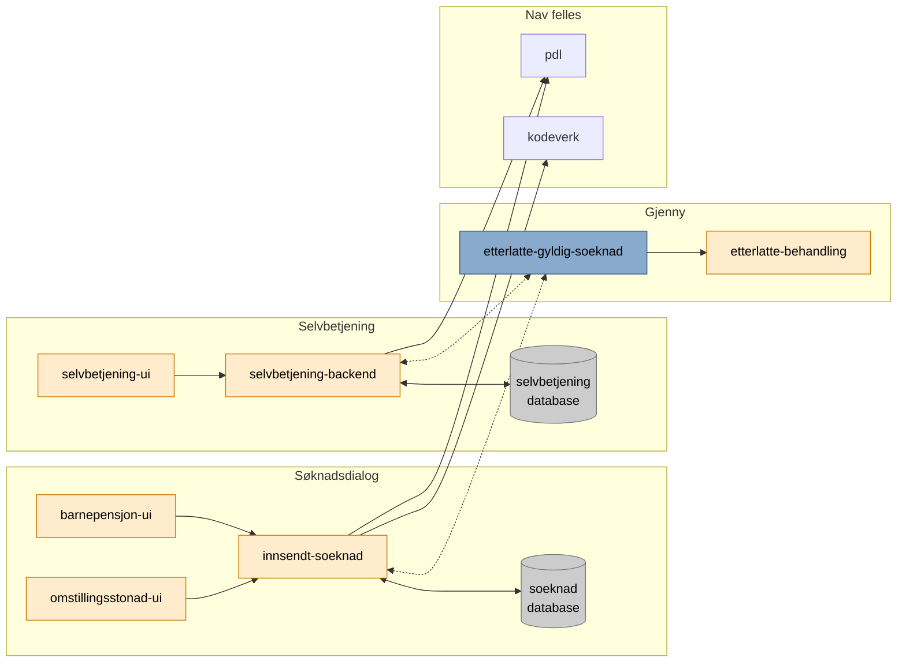

# pensjon-etterlatte

Monorepo for ny løsning for ytelser til etterlatte.

Hvordan appene henger sammen kan du se
her: [Arkitekturskisse - Confluence](https://confluence.adeo.no/display/TE/Arkitektur)

# Apper

[barnepensjon-ui](apps/barnepensjon-ui) \
Brukergrensesnittet for "Søknad om barnepensjon".

[etterlatte-node-server](apps/etterlatte-node-server) \
Felles node backend for søknadsdialogene (omstillingsstønad og barnepensjon).

[innsendt-soeknad](apps/innsendt-soeknad) \
Baksystemapplikasjon for håndtering av søknader (lagring, uthenting, sending, hente data fra pdl og kodeverk, m.m.).

[omstillingsstoenad-ui](apps/omstillingsstoenad-ui) \
Brukergrensesnittet for "Søknad om omstillingsstønad".

[selvbetjening-ui](apps/selvbetjening-ui) \
Brukergrenesnitt for selvbetjeningsløsningene til etterlatteytelsen

# Flyt

### Søknad mottatt

# Felles apper

Alle apper som er felles for Team Etterlatte ligger
i [etterlatte-pensjon-felles](https://github.com/navikt/pensjon-etterlatte-felles).

# Kafka / Rapids & Rivers

Topic.yaml-filer er flyttet til [etterlatte-pensjon-felles](https://github.com/navikt/pensjon-etterlatte-felles).

# Bygg og deploy

En app bygges og deployes automatisk når en endring legges til i `main`.

For å trigge **manuell deploy** kan du gå til `Actions -> (velg workflow) -> Run workflow from <branch>`

# Sjekker

I frontend bruker vi `license-checker-rseidelsohn`, som kjøres automatisk i GitHub-actions-byggejobben, og som kan
køyrast manuelt med `yarn lisenssjekk`

# Henvendelser

Spørsmål knyttet til koden eller prosjektet kan stilles som issues her på GitHub.

## For Nav-ansatte

Interne henvendelser kan sendes via Slack i kanalen #po-pensjon-team-etterlatte.
