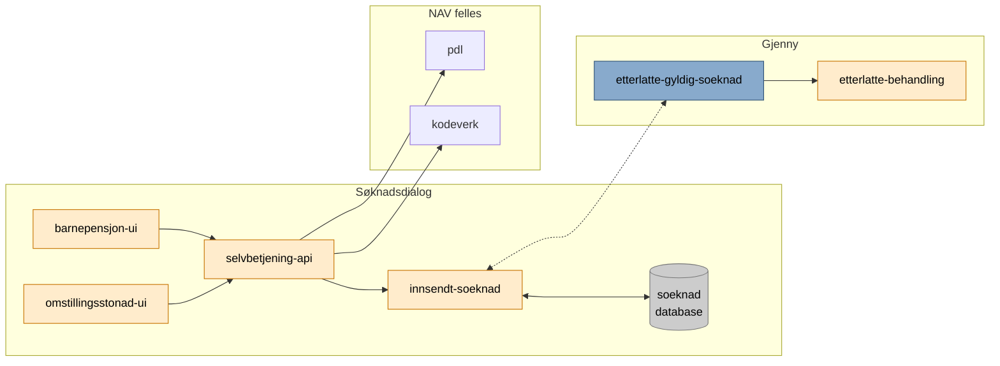

# pensjon-etterlatte

Monorepo for ny løsning for ytelser til etterlatte.

Hvordan appene henger sammen kan du se her: [Arkitekturskisse - Confluence](https://confluence.adeo.no/display/TE/Arkitektur)

# Apper

[barnepensjon-ui](apps/barnepensjon-ui) \
Brukergrensesnittet for "Søknad om barnepensjon".

[etterlatte-node-server](apps/etterlatte-node-server) \
Felles node backend for søknadsdialogene (omstillingsstønad og barnepensjon).

[innsendt-soeknad](apps/innsendt-soeknad) \
Database app for håndtering av søknader (lagring, uthenting, sending, m.m.).

[omstillingsstoenad-ui](apps/omstillingsstoenad-ui) \
Brukergrensesnittet for "Søknad om omstillingsstønad".

[selvbetjening-api](apps/selvbetjening-api) \
API som tilgjengeliggjør data for frontend å kommunisere med diverse apper. 

# Flyt

### Søknad mottatt

# Kom i gang

Noen avhengigheter i prosjektet ligger i Github Package Registry som krever autentisering. Det enkleste er å lage en [PAT (Personal Access Token)](https://github.com/settings/tokens). 

1. [Opprett PAT her](https://github.com/settings/tokens). I tilfelle lenken ikke fungerer går man til `Github -> Settings -> Developer settings -> Personal access tokens`
2. Huk av `read:packages`. Ikke legg til flere scopes enn nødvendig.
3. Autoriser navikt-organisasjonen for SSO ved å velge "Configure SSO" på tokenet
4. Tokenet legges i `.zshrc` med `export GITHUB_TOKEN=<token>`

# Felles apper

Alle apper som er felles for Team Etterlatte ligger i [etterlatte-pensjon-felles](https://github.com/navikt/pensjon-etterlatte-felles).  

# Kafka / Rapids & Rivers

Topic.yaml-filer er flyttet til [etterlatte-pensjon-felles](https://github.com/navikt/pensjon-etterlatte-felles).

# Bygg og deploy

En app bygges og deployes automatisk når en endring legges til i `main`. 

For å trigge **manuell deploy** kan du gå til `Actions -> (velg workflow) -> Run workflow from <branch>`

# Henvendelser

Spørsmål knyttet til koden eller prosjektet kan stilles som issues her på GitHub.

## For NAV-ansatte

Interne henvendelser kan sendes via Slack i kanalen #po-pensjon-team-etterlatte.
